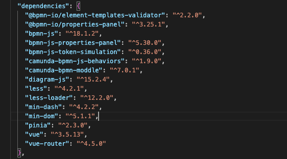
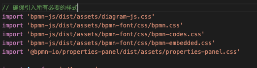
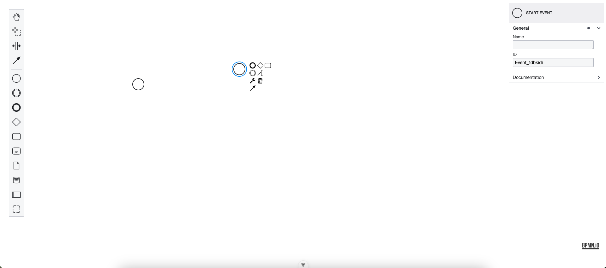

### Here are some steps I took to integrate BPMN JS in the Vue3 project

## 1. Install bpnm-js

## 2.Introducing the bpnm style

## Next, you can check the code I wrote in BpmnModeler.vue

## This is my example

